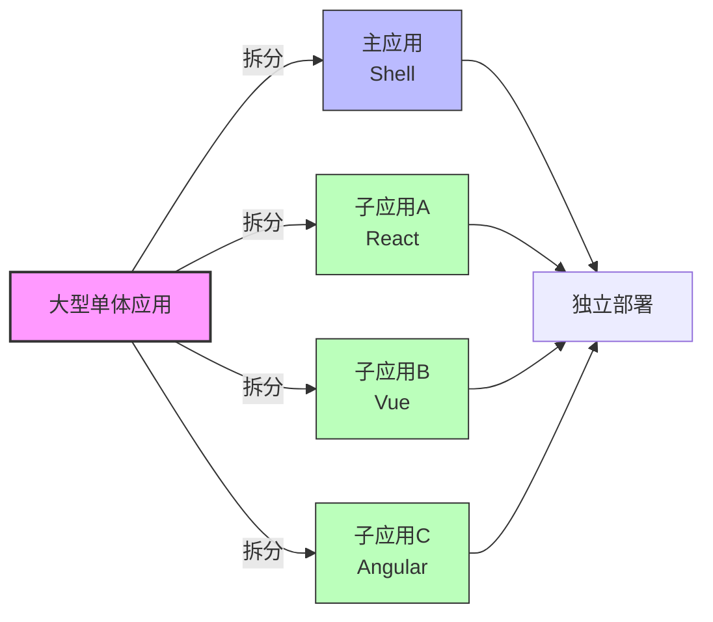
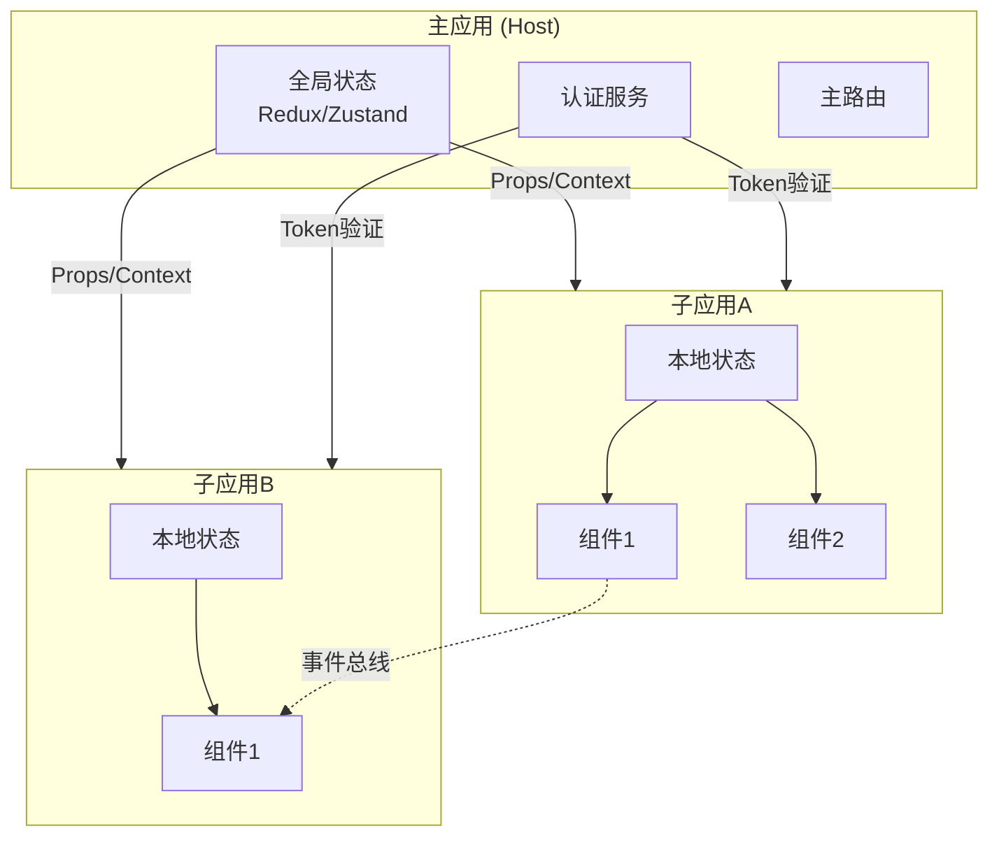

# 26 - 微前端架构（Qiankun/Module Federation）

## 🎯 本节目标
- 理解微前端的概念、优势和适用场景
- 掌握 Qiankun 和 Module Federation 两种主流方案
- 学会构建生产级的微前端应用

---

## 📖 微前端基础概念

### 什么是微前端？

微前端是一种**将前端应用拆分成更小、更简单的部分的技术**，每个部分可以独立开发、测试和部署。

### 核心价值



**优势**
- ✅ **独立部署**: 各团队可独立发布，互不影响
- ✅ **技术栈无关**: 可混用 React/Vue/Angular 等
- ✅ **增量升级**: 逐步迁移旧系统，风险可控
- ✅ **团队自治**: 不同团队负责不同模块
- ✅ **代码隔离**: 避免大型 monorepo 的冲突问题

**挑战**
- ⚠️ **复杂度增加**: 需要处理应用间通信、样式隔离等
- ⚠️ **性能开销**: 多次加载运行时
- ⚠️ **调试困难**: 跨应用调试相对复杂
- ⚠️ **版本管理**: 主/子应用的依赖版本协调

---

## 🔧 方案一：Qiankun（蚂蚁金服出品）

### 基础配置

#### 1. 安装依赖

```bash
# 主应用安装 qiankun
npm install qiankun --save
```

#### 2. 主应用（Host）配置

```jsx
// src/main.js
import { registerMicroApps, start } from 'qiankun';

// 注册子应用
registerMicroApps([
  {
    name: 'app-react', // 子应用名称（必须唯一）
    entry: '//localhost:7101', // 子应用地址（支持本地开发或CDN）
    container: '#subapp-viewport', // 挂载容器DOM节点
    activeRule: '/react', // 激活路由规则
    props: { // 传递给子应用的数据
      token: 'main-app-token',
      getUserInfo: () => fetchUserInfo(),
    },
  },
  {
    name: 'app-vue',
    entry: '//localhost:7102',
    container: '#subapp-viewport',
    activeRule: '/vue',
    props: {
      token: 'main-app-token',
    },
  },
], {
  beforeLoad: [
    app => {
      console.log('before load', app.name);
      return Promise.resolve();
    },
  ],
  beforeMount: [
    app => {
      console.log('before mount', app.name);
      return Promise.resolve();
    },
  ],
  afterMount: [
    app => {
      console.log('after mount', app.name);
      return Promise.resolve();
    },
  ],
  afterUnmount: [
    app => {
      console.log('after unload', app.name);
      return Promise.resolve();
    },
  ],
});

// 启动 qiankun
start({
  prefetch: 'all', // 预加载所有子应用资源
  sandbox: {
    experimentalStyleIsolation: true, // 样式隔离（实验性）
    strictStyleIsolation: true, // 严格样式隔离（Shadow DOM）
  },
});
```

#### 3. 主应用组件示例

```jsx
// src/App.jsx
import { useState, useEffect } from 'react';
import { loadMicroApp, initGlobalState } from 'qiankun';
import MicroFrontendLayout from './components/MicroFrontendLayout';

function App() {
  const [currentUser, setCurrentUser] = useState(null);

  useEffect(() => {
    // 初始化全局状态管理（用于主/子应用通信）
    const actions = initGlobalState({ user: null, theme: 'light' });

    // 监听全局状态变化
    actions.onGlobalStateChange((state, prev) => {
      console.log('全局状态变化:', state, prev);
      setCurrentUser(state.user);
    });

    // 设置初始状态
    actions.setGlobalState({
      user: { name: 'Admin', role: 'admin' },
      theme: localStorage.getItem('theme') || 'light',
    });

    return () => {
      // 卸载时取消监听
      actions.offGlobalStateChange();
    };
  }, []);

  return (
    <div className="micro-frontend-app">
      {/* 主应用头部导航 */}
      <Header user={currentUser} />

      <main className="main-content">
        {/* 主应用自己的路由 */}
        <Routes>
          <Route path="/" element={<HomePage />} />
          <Route path="/settings" element={<SettingsPage />} />
        </Routes>

        {/* 子应用挂载容器 */}
        <div id="subapp-viewport" />
      </main>

      {/* 主应用底部 */}
      <Footer />
    </div>
  );
}

export default App;
```

#### 4. 子应用（React）改造

```javascript
// src/main.js（React子应用入口文件）
import React from 'react';
import ReactDOM from 'react-dom/client';
import App from './App';

let root = null;

/**
 * 渲染函数（主应用调用或独立运行时使用）
 */
function render(props = {}) {
  const { container, token } = props;

  // 使用qiankun提供的容器或直接用body
  const mountNode = container
    ? container.querySelector('#root')
    : document.getElementById('root');

  root = ReactDOM.createRoot(mountNode);
  root.render(
    <React.StrictMode>
      <App token={token} />
    </React.StrictMode>
  );
}

/**
 * 独立运行时（本地开发时可直接访问）
 */
if (!window.__POWERED_BY_QIANKUN__) {
  render();
}

/**
 * qiankun生命周期钩子 - 必须导出
 */
export async function bootstrap() {
  console.log('[react app] bootstraped');
  return Promise.resolve();
}

export async function mount(props) {
  console.log('[react app] mount, props from main app:', props);
  render(props);
  return Promise.resolve();
}

export async function unmount(props) {
  if (root) {
    root.unmount();
    root = null;
  }
  return Promise.resolve();
}

/**
 * 可选：更新函数（当主应用props变化时触发）
 */
export async function update(props) {
  console.log('[react app] updated with new props:', props);
  return Promise.resolve();
}
```

```javascript
// vue.config.js 或 webpack.config.js（子应用webpack配置）
const packageName = require('./package.json').name;

module.exports = {
  devServer: {
    port: 7101,
    headers: {
      'Access-Control-Allow-Origin': '*', // 允许跨域
    },
  },

  output: {
    library: `${packageName}-[name]`, // UMD名称
    libraryTarget: 'umd', // 输出为UMD格式
    jsonpFunction: `webpackJsonp_${packageName}`, // webpack的jsonp函数名（避免冲突）
  },
};
```

### Qiankun 高级特性

#### 应用间通信机制

```jsx
// src/utils/microActions.js
import { initGlobalState } from 'qiankun';

// 初始化全局状态
const actions = initGlobalState({
  user: null,
  theme: 'light',
  locale: 'zh-CN',
});

// 封装通信方法
const MicroActions = {
  /**
   * 监听全局状态变化
   * @param {Function} callback - 回调函数(state, prev)
   * @returns {Function} 取消监听的函数
   */
  onGlobalStateChange(callback) {
    return actions.onGlobalStateChange(callback, true); // true=立即触发一次
  },

  /**
   * 设置全局状态
   * @param {Object} newState - 新的状态对象
   */
  setGlobalState(newState) {
    actions.setGlobalState(newState);
  },

  /**
   * 获取当前全局状态（只读快照）
   */
  getGlobalState() {
    return actions.getGlobalState();
  },

  /**
   * 发送自定义事件（用于更复杂的场景）
   */
  emit(eventName, data) {
    // 使用CustomEvent实现自定义事件
    const event = new CustomEvent(`micro:${eventName}`, { detail: data });
    window.dispatchEvent(event);
  },

  /**
   * 监听自定义事件
   */
  on(eventName, handler) {
    window.addEventListener(`micro:${eventName}`, handler);
    return () => window.removeEventListener(`micro:${eventName}`, handler);
  },
};

export default MicroActions;
```

```jsx
// 在子应用中使用
import MicroActions from '@/utils/microActions';

function UserProfile() {
  const [user, setUser] = useState(null);

  useEffect(() => {
    // 监听用户信息变化（可能是主应用或其他子应用更新的）
    const unsubscribe = MicroActions.onGlobalStateChange((state) => {
      setUser(state.user);
    });

    // 监听自定义事件
    const offLogout = MicroActions.on('logout', () => {
      console.log('收到登出事件');
      setUser(null);
    });

    return () => {
      unsubscribe();
      offLogout();
    };
  }, []);

  const handleUpdateUser = (newData) => {
    // 更新全局状态，通知其他应用
    MicroActions.setGlobalState({
      user: { ...user, ...newData },
    });

    // 或者发送事件
    MicroActions.emit('userUpdated', newData);
  };

  return (
    <div className="user-profile">
      <h1>欢迎, {user?.name || '游客'}</h1>
      <button onClick={() => handleUpdateUser({ name: '新名字' })}>
        更新用户名
      </button>
    </div>
  );
}
```

#### 样式隔离方案

```css
/* 选项一：实验性动态样式表（推荐简单场景） */
/* qiankun会自动给每个子应用的CSS添加特殊前缀 */

/* 选项二：严格样式隔离（Shadow DOM） */
/* 完全隔离但可能导致一些库不兼容 */

/* 选项三：手动约定命名空间 */
/* .app-react__container { ... } */
/* .app-vue__container { ... } */
```

```javascript
// qiankun启动配置中的sandbox选项
start({
  sandbox: {
    // 实验性方案：动态修改CSS选择器（默认开启）
    experimentalStyleIsolation: true,
    
    // 严格方案：使用Shadow DOM（慎用！）
    strictStyleIsolation: false,
    
    // 是否排除某些沙箱特性
    excludeAssetFilter: (assetUrl) => {
      // 排除某些需要全局生效的资源（如CDN字体）
      return assetUrl.includes('fonts.googleapis.com');
    },
  },
});
```

#### 动态加载与卸载

```jsx
// 手动加载/卸载单个子应用（适用于非路由驱动的场景）
import { loadMicroApp } from 'qiankun';

function DashboardWidget() {
  const containerRef = useRef(null);
  let microApp = null;

  useEffect(() => {
    // 手动加载子应用作为微组件
    microApp = loadMicroApp({
      name: 'widget-chart',
      entry: '//localhost:7103',
      container: containerRef.current,
      props: { data: chartData },
    });

    return () => {
      // 组件卸载时也卸载微应用
      if (microApp) {
        microApp.unmount().then(() => {
          microApp = null;
        });
      }
    };
  }, []);

  return <div ref={containerRef} style={{ width: '100%', height: 400 }} />;
}
```

---

## 📦 方案二：Module Federation（Webpack 5+ / Vite）

### 概念对比

| 特性 | Qiankun | Module Federation |
|------|---------|-------------------|
| **运行时加载** | ✅ 运行时加载 | ✅ 编译时 + 运行时 |
| **技术栈限制** | 无限制 | 最好相同框架 |
| **共享依赖** | 不支持 | ✅ 原生支持 |
| **类型安全** | 弱 | 强（TypeScript友好） |
| **构建工具** | 任意 | Webpack 5+ / Vite/Rspack |
| **学习曲线** | 中等 | 较低 |
| **社区成熟度** | 成熟 | 快速发展中 |

### Webpack 5 配置示例

```javascript
// host-app/webpack.config.js（主应用）
const ModuleFederationPlugin = require('webpack/lib/container/ModuleFederationPlugin');

module.exports = {
  entry: './src/index.js',
  
  plugins: [
    new ModuleFederationPlugin({
      name: 'host_app',
      
      // 远程模块声明（从其他应用导入）
      remotes: {
        // 方式一：完整URL
        remoteReactApp: 'remoteReactApp@http://localhost:3001/remoteEntry.js',
        
        // 方式二：变量引用（适合多环境）
        remoteVueApp: `remoteVueApp@${process.env.VUE_APP_REMOTE_URL}/remoteEntry.js`,
      },
      
      // 共享依赖（避免重复打包）
      shared: {
        react: { 
          singleton: true, // 全局单例
          requiredVersion: '^18.0.0', // 版本要求
          eager: false, // 异步加载
        },
        'react-dom': {
          singleton: true,
          requiredVersion: '^18.0.0',
        },
      },
    }),
  ],
};
```

```javascript
// remote-app-1/webpack.config.js（远程应用1 - React）
module.exports = {
  plugins: [
    new ModuleFederationPlugin({
      name: 'remoteReactApp',
      
      filename: 'remoteEntry.js', // 入口文件名
      
      // 暴露的模块（供其他应用消费）
      exposes: {
        // 暴露整个应用（作为子应用使用）
        './App': './src/App',
        './Component': './src/components/DashboardWidget',
        './utils': './src/utils/helpers',
        
        // 暴露Hook
        './useAuth': './src/hooks/useAuth',
      },
      
      // 共享依赖
      shared: {
        react: { singleton: true, requiredVersion: '^18.0.0' },
        'react-dom': { singleton: true, requiredVersion: '^18.0.0' },
      },
    }),
  ],
};
```

### 在 React 中使用

```jsx
// host-app/src/App.jsx（主应用中使用远程模块）
import React, { Suspense, lazy } from 'react';

// 方式一：静态导入远程模块
const RemoteDashboardWidget = lazy(() => import('remoteReactApp/Component'));
const RemoteAuthHookFactory = lazy(() => import('remoteReactApp/useAuth'));

// 方式二：动态加载（条件性加载）
function DynamicRemoteModule({ appName }) {
  const [Module, setModule] = useState(null);

  useEffect(async () => {
    try {
      // 根据参数动态决定加载哪个远程模块
      const module = await import(`${appName}/App`);
      setModule(module.default);
    } catch (error) {
      console.error('Failed to load remote module:', error);
    }
  }, [appName]);

  if (!Module) {
    return <LoadingSpinner />;
  }

  return <Module />;
}

function HostApp() {
  return (
    <div className="host-application">
      {/* 本地组件 */}
      <LocalHeader />
      
      <main>
        {/* 加载远程模块 */}
        <Suspense fallback={<ModuleSkeleton />}>
          <RemoteDashboardWidget data={dashboardData} />
        </Suspense>

        {/* 条件渲染远程模块 */}
        {showAdvancedFeatures && (
          <Suspense fallback={<LoadingFallback />}>
            <DynamicRemoteModule appName="remoteReactApp" />
          </Suspense>
        )}
      </main>

      {/* 本地组件 */}
      <LocalFooter />
    </div>
  );
}
```

### Vite + Module Federation (@originjs/vite-plugin-federation)

```bash
# 安装Vite插件
npm install @originjs/vite-plugin-federation --save-dev
```

```javascript
// vite.config.ts（远程应用）
import { defineConfig } from 'vite';
import federation from '@originjs/vite-plugin-federation';
import react from '@vitejs/plugin-react';

export default defineConfig({
  plugins: [
    react(),
    federation({
      name: 'remote_module',
      filename: 'remoteEntry.js',

      // 暴露模块
      exposes: {
        './Button': './src/components/Button',
        './Card': './src/components/Card',
        './useTheme': './src/hooks/useTheme',
      },

      // 共享依赖
      shared: ['react', 'react-dom'],
    }),
  ],

  build: {
    target: 'esnext', // 必须是esnext以支持动态导入
  },
});
```

```typescript
// host-app/vite.config.ts（主应用）
import federation from '@originjs/vite-plugin-federation';

export default defineConfig({
  plugins: [
    federation({
      name: 'host_app',
      
      remotes: {
        remoteModule: 'remoteModule@http://localhost:5001/remoteEntry.js',
      },

      shared: ['react', 'react-dom'],
    }),
  ],
});
```

```tsx
// host-app/src/App.tsx
const RemoteButton = React.lazy(() => import('remoteModule/Button'));
const RemoteCard = React.lazy(() => import('remoteModule/Card'));

function App() {
  return (
    <div>
      <h1>Host Application</h1>
      
      <Suspense fallback={<p>Loading remote component...</p>}>
        <RemoteButton onClick={() => alert('Hello from remote!')}>
          Click Me!
        </RemoteButton>

        <RemoteCard title="Remote Card">
          This content comes from a remote module.
        </RemoteCard>
      </Suspense>
    </div>
  );
}
```

---

## 🏗️ 微前端架构最佳实践

### 项目目录结构建议

```
micro-frontend-monorepo/
├── apps/
│   ├── host/                    # 主应用（Shell）
│   │   ├── package.json
│   │   ├── vite.config.ts
│   │   └── src/
│   ├── app-dashboard/           # 子应用：仪表盘（React）
│   │   ├── package.json
│   │   ├── webpack.config.js
│   │   └── src/
│   ├── app-user-center/         # 子应用：用户中心（Vue）
│   │   ├── package.json
│   │   └── src/
│   └── app-settings/            # 子应用：设置页面
│       └── ...
│
├── packages/                     # 共享包
│   ├── shared-types/             # TypeScript类型定义
│   ├── shared-utils/             # 工具函数库
│   ├── ui-components/            # UI组件库（可选）
│   └── micro-actions/            # 通信层抽象
│
├── deploy/                       # 部署配置
│   ├── nginx.conf               # Nginx反向代理配置
│   └── docker-compose.yml       # Docker编排
│
├── package.json                 # Monorepo根package.json（workspace）
├── pnpm-workspace.yaml          # pnpm workspace配置
└── turbo.json                   # Turborepo构建加速配置（可选）
```

### 共享依赖策略

```jsonc
{
  "dependencies": {
    "react": "^18.2.0",
    "react-dom": "^18.2.0",
    "axios": "^1.6.0",
    "dayjs": "^1.11.0",
    "lodash-es": "^4.17.21"
  }
}
```
> **关键**: 所有应用必须锁定相同的依赖版本范围！

### 状态管理与数据流



**推荐架构**:
- **主应用**: 负责**全局状态**(用户信息、权限)、**认证**、**布局框架**
- **子应用**: 管理**自身业务状态**，通过**事件/回调**与外部交互
- **共享服务**: 认证、HTTP客户端、日志、监控等抽取到`packages/shared-utils`

### 错误边界与降级策略

```jsx
// apps/host/src/components/MicroAppErrorBoundary.jsx
class MicroAppErrorBoundary extends React.Component {
  constructor(props) {
    super(props);
    this.state = { hasError: false, errorInfo: null };
  }

  static getDerivedStateFromError(error) {
    return { hasError: true };
  }

  componentDidCatch(error, errorInfo) {
    this.setState({ errorInfo });
    
    // 上报错误到监控系统
    logErrorToService(error, {
      context: 'micro-frontend',
      appName: this.props.appName,
      stacktrace: errorInfo.componentStack,
    });
  }

  render() {
    if (this.state.hasError) {
      return (
        <div className="micro-app-error-fallback">
          <h2>⚠️ 子应用 "{this.props.appName}" 加载失败</h2>
          
          <details>
            <summary>技术详情</summary>
            <pre>{this.state.errorInfo?.componentStack}</pre>
          </details>

          <div className="error-actions">
            <button onClick={this.handleRetry}>重新加载</button>
            <a href="/">返回首页</a>
          </div>
        </div>
      );
    }

    return this.props.children;
  }

  handleRetry = () => {
    this.setState({ hasError: false, errorInfo: null });
    // 触发子应用重新加载
    if (this.props.onRetry) {
      this.props.onRetry();
    }
  };
}
```

### Nginx 部署配置（重要!）

```nginx
# /etc/nginx/conf.d/micro-frontend.conf
server {
    listen 80;
    server_name your-domain.com;

    # 主应用
    location / {
        root /var/www/host-app;
        try_files $uri $uri/ /index.html;  # SPA fallback
    }

    # 子应用1 - React仪表盘
    location /dashboard/ {
        proxy_pass http://localhost:8081/;
        proxy_set_header Host $host;
        proxy_set_header X-Real-IP $remote_addr;
        proxy_set_header X-Forwarded-For $proxy_add_x_forwarded_for;
        proxy_http_version 1.1;
        proxy_set_header Upgrade $http_upgrade;
        proxy_set_header Connection "upgrade";
    }

    # 子应用2 - Vue用户中心
    location /user-center/ {
        proxy_pass http://localhost:8082/;
        # ... 同上headers
    }

    # 静态资源缓存策略
    location ~* \.(?:ico|css|js|gif|jpe?g|png|svg|woff2?)$ {
        expires 1y;
        add_header Cache-Control "public, immutable";
        access_log off;
    }

    # Gzip压缩
    gzip on;
    gzip_types text/plain text/css application/json application/javascript text/xml application/xml application/xml+rss text/javascript image/svg+xml;
}
```

---

## 🧪 测试策略

### 单元测试

```jsx
// __tests__/MicroAppLoader.test.jsx
import { render, screen, waitFor } from '@testing-library/react';
import { MicroAppLoader } from '../components/MicroAppLoader';

// Mock qiankun
jest.mock('qiankun', () => ({
  registerMicroApps: jest.fn(),
  start: jest.fn(),
  loadMicroApp: jest.fn(() =>
    Promise.resolve({
      unmount: jest.fn(),
      getStatus: () => 'MOUNTED',
    })
  ),
}));

test('正确渲染微应用加载器并处理错误', async () => {
  render(<MicroAppLoader name="test-app" entry="//localhost:7101" />);

  expect(screen.getByText(/loading/i)).toBeInTheDocument();

  await waitFor(() => {
    expect(screen.getByText(/loaded successfully/i)).toBeInTheDocument();
  });
});
```

### E2E 测试（Cypress/Playwright）

```javascript
// cypress/e2e/micro-frontend.spec.cy.js
describe('微前端集成测试', () => {
  it('应该能正常加载并切换子应用', () => {
    cy.visit('/');

    // 验证主应用已加载
    cy.get('header').should('be.visible');
    cy.contains('Home').click();

    // 导航到子应用
    cy.contains('Dashboard').click();

    // 验证子应用已加载
    cy.url().should('include', '/dashboard');
    cy.get('#subapp-viewport').should('not.be.empty');
    cy.contains('Welcome to Dashboard App'); // 子应用内容

    // 验证子应用功能
    cy.get('.chart-widget').should('be.visible');
  });

  it('子应用崩溃时应显示降级UI', () => {
    // Mock子应用抛出错误
    cy.intercept('GET', '**/remoteEntry.js', { forceNetworkError: true });

    cy.visit('/react');

    // 应该显示错误边界fallback
    cy.contains(/failed to load/i).should('be.visible');
    cy.contains('retry').click(); // 重试按钮可用
  });
});
```

---

## ⚠️ 常见问题与解决方案

### 问题1: 子应用间样式冲突

**解决方案**:
1. 使用 CSS Modules 或 CSS-in-JS
2. 开启 Qiankun 的 `experimentalStyleIsolation`
3. 为每个子应用添加唯一的 CSS 命名前缀 (如 `.app-react-xxx`)
4. 使用 PostCSS 插件自动加前缀

### 问题2: 全局变量/事件污染

```javascript
// ❌ 直接在window上挂载
window.myGlobalVar = 'xxx';  // 可能覆盖其他应用

// ✅ 使用namespace隔离
window.__MICRO_APP_NAME__ = window.__MICRO_APP_NAME__ || {};
window.__MICRO_APP_NAME__.myVar = 'xxx';
```

### 问题3: 路由冲突

**原则**: 主应用负责顶层路由，子应用使用**嵌套路由**或**Hash路由**

```jsx
// 主应用路由
<Route path="/dashboard/*" element={<MicroAppContainer />} />

// 子应用内部路由（base设为/dashboard）
createBrowserRouter([
  {
    path: '/dashboard',
    children: [
      { index: true, element: <DashboardOverview /> },
      { path: 'analytics', element: <AnalyticsPage /> },
    ],
  },
]);
```

### 问题4: 性能优化

```javascript
// 启用预加载和缓存策略
registerMicroApps([...apps], {...}, {
  prefetch: 'all',  // 预加载
  sandbox: { ... },
  getTemplate(tpl) {
    // 缓存模板
    return cache.get(tpl) || cache.set(tpl, tpl);
  },
});

// 使用importmap预加载共享依赖（浏览器原生支持）
<script type="importmap">
{
  "imports": {
    "react": "https://cdn.example.com/react@18.esm.js",
    "react-dom": "https://cdn.example.com/react-dom@18.esm.js"
  }
}
</script>
```

---

## 📝 练习任务

### 任务1:搭建完整的Qiankun微前端项目
创建一个包含以下内容的Monorepo:
1. **主应用(Shell)**: 包含导航栏、登录页、基础布局
2. **子应用A (React)**: 用户管理模块(CRUD)
3. **子应用B (Vue)**: 商品展示页面
4. 实现**跨应用登录态同步**
5. 实现**主题切换联动**

### 任务2:迁移现有项目到Module Federation
将一个现有的中大型SPA拆分为:
1. 主应用(核心布局+路由)
2. 两个远程模块(分别暴露不同的业务组件)
3. 配置**共享依赖**(React, UI库, Utils)
4. 实现**类型安全的远程模块导入**

### 任务3:生产环境部署演练
完成以下DevOps工作:
1. **Docker化**每个应用
2. **Nginx反向代理**配置
3. **CI/CD流水线** (GitHub Actions/GitLab CI)
4. **灰度发布**策略 (基于cookie或feature flag控制新版本)

---

## 🔗 相关资源

- [Qiankun官方文档](https://qiankun.umijs.org/)
- [Webpack 5 Module Federation文档](https://webpack.js.org/concepts/module-federation/)
- [Module Federation Examples](https://github.com/module-federation/module-federation-examples)
- [微前端架构笔记 - 阿里技术](https://tech.antfin.com/articles/BQiAMk)
- [Single-SPA (另一种方案)](https://single-spa.js.org/)
- [Garfish (字节跳动微前端)](https://garfish.js.org/zh-CN/docs/start)

---

[← 25 - 错误处理](../25-error-handling/) | [→ 27 - PWA离线应用](../27-pwa/)
