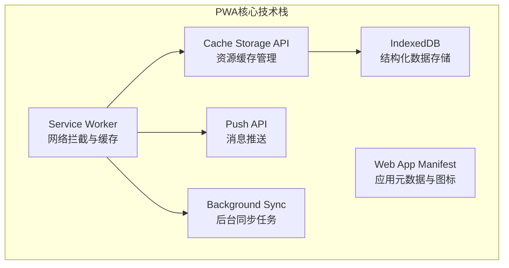

# 27 - PWA离线应用（Progressive Web Apps）

## 🎯 本节目标
- 理解PWA的核心概念和技术组成
- 掌握Service Worker的生命周期和缓存策略
- 构建可离线使用的现代Web应用

---

## 📖 PWA概述

### 什么是PWA？

PWA (Progressive Web App) 是一种**结合了Web和原生应用优点的新一代Web应用模型**。

**核心能力**
- ✅ **离线访问**: 通过Service Worker缓存关键资源
- ✅ **安装到桌面**: 类似原生App的体验(Web App Manifest)
- ✅ **推送通知**: 即使关闭页面也能接收消息(Push API)
- ✅ **后台同步**: 在后台执行任务(Background Sync API)
- ✅ **全屏沉浸式**: 移除浏览器的UI干扰

### 技术组成



---

## 🔧 Service Worker基础

### 1. 注册与生命周期

```javascript
// public/sw-register.js (或在main.jsx中)
if ('serviceWorker' in navigator) {
  window.addEventListener('load', () => {
    navigator.serviceWorker
      .register('/service-worker.js', {
        scope: '/',  // SW控制的路径范围
        type: 'module',  // 支持ES模块语法(Chrome95+)
      })
      .then(registration => {
        console.log('SW registered:', registration.scope);

        // 检查是否有更新
        registration.addEventListener('updatefound', () => {
          const newWorker = registration.installing;
          
          newWorker.addEventListener('statechange', () => {
            if (newWorker.state === 'installed' && navigator.serviceWorker.controller) {
              // 有新的SW可用,提示用户刷新
              showUpdateNotification();
            }
          });
        });
      })
      .catch(error => {
        console.error('SW registration failed:', error);
      });
  });

  // 监控SW控制器变更(如用户首次访问或强制刷新后)
  let refreshing = false;
  navigator.serviceWorker.addEventListener('controllerchange', () => {
    if (!refreshing) {
      refreshing = true;
      window.location.reload();  // 自动刷新以获取最新内容
    }
  });
}
```

```javascript
// public/service-worker.js (Service Worker文件)
const CACHE_NAME = 'my-pwa-v1';
const STATIC_ASSETS = [
  '/',
  '/index.html',
  '/manifest.json',
  '/icons/icon-192.png',
  '/icons/icon-512.png',
];

// 1. 安装阶段:预缓存核心资源
self.addEventListener('install', event => {
  console.log('SW installing...');
  
  event.waitUntil(
    caches.open(CACHE_NAME)
      .then(cache => {
        console.log('Caching static assets');
        return cache.addAll(STATIC_ASSETS);  // 预缓存关键文件
      })
      .then(() => self.skipWaiting())  // 立即激活,不等旧的SW退出
  );
});

// 2. 激活阶段:清理旧缓存
self.addEventListener('activate', event => {
  console.log('SW activating...');
  
  event.waitUntil(
    caches.keys()
      .then(cacheNames => {
        return Promise.all(
          cacheNames
            .filter(name => name !== CACHE_NAME)  // 删除非当前版本的缓存
            .map(name => caches.delete(name))
        );
      })
      .then(() => self.clients.claim())  // 立即控制所有页面
  );
});
```

### 2. 缓存策略详解

```javascript
// service-worker.js - 各种缓存策略实现

/**
 * 策略一: Cache First (缓存优先)
 * 适用场景: 静态资源(CSS/JS/图片/字体),很少变化的文件
 */
async function cacheFirst(request) {
  const cachedResponse = await caches.match(request);
  
  if (cachedResponse) {
    return cachedResponse;  // 命中缓存则返回
  }
  
  try {
    const networkResponse = await fetch(request);
    
    // 缓存成功的响应(只缓存GET请求且状态码正常的响应)
    if (networkResponse.ok && request.method === 'GET') {
      const cache = await caches.open(CACHE_NAME);
      cache.put(request, networkResponse.clone());
    }
    
    return networkResponse;
  } catch (error) {
    console.error('Fetch failed:', error);
    throw error;  // 可以返回offline fallback
  }
}

/**
 * 策略二: Network First (网络优先)
 * 适用场景: API数据(Html/JSON),需要实时性的内容
 */
async function networkFirst(request) {
  const cache = await caches.open(CACHE_NAME);

  try {
    const networkResponse = await fetch(request);
    
    if (networkResponse.ok) {
      cache.put(request, networkResponse.clone());  // 更新缓存
    }
    
    return networkResponse;
  } catch (error) {
    console.log('Network failed, trying cache...');
    const cachedResponse = await cache.match(request);
    
    if (cachedResponse) {
      return cachedResponse;  // 返回可能过期的缓存
    }
    
    throw error;  // 彻底失败,可以返回offline fallback
  }
}

/**
 * 策略三: Stale While Revalidate (过期同时重新验证)
 * 适用场景: Logo、导航栏、不太重要的图片等
 * 行为: 先返回缓存,同时在后台更新缓存供下次使用
 */
async function staleWhileRevalidate(request) {
  const cache = await caches.open(CACHE_NAME);
  const cachedResponse = await cache.match(request);

  // 后台异步更新(不阻塞当前响应)
  const fetchPromise = fetch(request)
    .then(networkResponse => {
      if (networkResponse.ok) {
        cache.put(request, networkResponse.clone());
      }
      return networkResponse;
    })
    .catch(() => cachedResponse);  // 网络失败也无所谓

  // 立即返回缓存(即使过期)
  return cachedResponse || fetchPromise;
}

/**
 * 策略四: Network Only (仅网络)
 * 适用场景: 需要绝对实时的数据(支付结果、即时聊天)
 */
async function networkOnly(request) {
  return fetch(request);
}

/**
 * 策略五: Cache Only (仅缓存)
 * 适用场景: 已确定缓存的静态资源
 */
async function cacheOnly(request) {
  const cachedResponse = await caches.match(request);
  
  if (!cachedResponse) {
    throw new Error('Resource not found in cache');
  }
  
  return cachedResponse;
}

// 3. 请求拦截(Fetch Event)
self.addEventListener('fetch', event => {
  const requestUrl = new URL(event.request.url);

  // 只处理同源请求(避免处理第三方API等)
  if (requestUrl.origin !== location.origin) {
    return;  // 让浏览器默认处理
  }

  // 根据URL特征选择策略
  if (requestUrl.pathname.startsWith('/api/')) {
    // API请求: Network First + 离线Fallback
    event.respondWith(
      networkFirst(event.request)
        .catch(() => caches.match('/offline-api-fallback.json'))
    );
  }
  else if (
    requestUrl.pathname.endsWith('.js') ||
    requestUrl.pathname.endsWith('.css') ||
    requestUrl.pathname.match(/\.(woff2?|ttf|otf|eot)$/)  // 字体
  ) {
    // 静态资源: Stale While Revalidate
    event.respondWith(staleWhileRevalidate(event.request));
  }
  else if (requestUrl.pathname.match(/\.(png|jpg|svg|gif|webp)$/))  // 图片
  ) {
    // 图片: Cache First (大图优先缓存)
    event.respondWith(cacheFirst(event.request));
  }
  else if (requestUrl.pathname === '/' || requestUrl.pathname.endsWith('.html')) {
    // HTML页面: Network First (确保拿到最新)
    event.respondWith(
      networkFirst(event.request)
        .catch(() => caches.match('/index.html'))
    );
  }
  else {
    // 默认策略
    event.respondWith(staleWhileRevalidate(event.request));
  }
});
```

### 3. Workbox (Google官方工具库)

```bash
# 安装Workbox CLI
npm install workbox-cli --save-dev
# 或使用webpack插件
npm install workbox-webpack-plugin --save-dev
```

```javascript
// webpack.config.js (或vite config)
const { GenerateSW } = require('workbox-webpack-plugin');

module.exports = {
  // 其他配置...
  plugins: [
    new GenerateSW({
      // 这些选项会自动生成service-worker.js
      swDest: 'service-worker.js',
      
      // 预缓存清单(自动根据构建产物生成)
      globPatterns: ['**/*.{js,html,css,png,ico,svg}'],
      
      // 运行时缓存策略
      runtimeCaching: [{
        urlPattern: /^https:\/\/api\..*\/api\/.*$/i,
        handler: 'NetworkFirst',
        options: {
          cacheName: 'api-cache',
          expiration: {
            maxEntries: 50,  // 最大缓存条目数
            maxAgeSeconds: 60 * 60 * 24 * 30,  // 30天过期
          },
          cacheableResponse: {
            statuses: [0, 200],
          },
        },
      }, {
        urlPattern: /^https:\/\/cdn\..*\.(png|jpg|svg)$/i,
        handler: 'CacheFirst',
        options: {
          cacheName: 'images-cache',
          expiration: {
            maxEntries: 100,
            maxAgeSeconds: 60 * 60 * 24 * 90,  // 90天
          },
        },
      }],
      
      // 跳过等待立即激活
      skipWaiting: true,
      clientsClaim: true,
      
      // 忽略某些URL
      ignoreURLParametersMatching:[/^utm_/, /^fbclid/],
    }),
  ],
};
```

---

## 📱 Web App Manifest

### manifest.json配置

```json
{
  "name": "我的PWA应用",
  "short_name": "MyPWA",
  "description": "一个功能丰富的渐进式Web应用",
  "start_url": "/",
  "scope": "/",
  "display": "standalone",  /* fullscreen/browser/standalone/minimal-ui */
  "orientation": "portrait-primary",  /* portrait/landscape/any */
  "background_color": "#ffffff",
  "theme_color": "#3b82f6",
  "lang": "zh-CN",
  "dir": "ltr",
  
  "icons": [
    {
      "src": "/icons/icon-72x72.png",
      "sizes": "72x72",
      "type": "image/png"
    },
    {
      "src": "/icons/icon-96x96.png",
      "sizes": "96x96",
      "type": "image/png"
    },
    {
      "src": "/icons/icon-128x128.png",
      "sizes": "128x128",
      "type": "image/png"
    },
    {
      "src": "/icons/icon-144x144.png",
      "sizes": "144x144",
      "type": "image/png"
    },
    {
      "src": "/icons/icon-152x152.png",
      "sizes": "152x152",
      "type": "image/png"
    },
    {
      "src": "/icons/icon-192x192.png",
      "sizes": "192x192",
      "type": "image/png",
      "purpose": "any maskable"  /* maskable用于自适应图标 */
    },
    {
      "src": "/icons/icon-384x384.png",
      "sizes": "384x384",
      "type": "image/png"
    },
    {
      "src": "/icons/icon-512x512.png",
      "sizes": "512x512",
      "type": "image/png",
      "purpose": "any maskable"
    }
  ],
  
  "categories": ["productivity", "utilities"],
  "screenshots": [],
  
  "related_applications": [],  /* 关联的原生应用(可选) */
  "prefer_related_applications": false,
  
  "shortcuts": [
    {
      "name": "新建文档",
      "short_name": "新建",
      "url": "/new-doc",
      "icons": [{ "src": "/icons/new-doc.png", "sizes": "96x96" }]
    },
    {
      "name": "搜索",
      "url": "/search"
    }
  ]
}
```

```html
<!-- index.html 中引入 -->
<link rel="manifest" href="/manifest.json">

<!-- 主题色(影响手机状态栏颜色) -->
<meta name="theme-color" content="#3b82f6">

<!-- Apple Touch Icon (iOS支持) -->
<link rel="apple-touch-icon" href="/icons/apple-touch-icon.png">

<!-- iOS PWA设置 -->
<meta name="apple-mobile-web-app-capable" content="yes">
<meta name="apple-mobile-web-app-status-bar-style" content="black-translucent">
<meta name="apple-mobile-web-app-title" content="MyPWA">

<!-- Windows磁贴图标 -->
<meta name="msapplication-TileImage" content="/icons/icon-144x144.png">
<meta name="msapplication-TileColor" content="#3b82f6">
```

### 动态Manifest (React Hook)

```jsx
// hooks/useManifest.js
import { useState, useCallback } from 'react';

function useDynamicManifest() {
  const updateManifest = useCallback((updates) => {
    // 获取现有manifest元素
    let manifestElement = document.querySelector('link[rel="manifest"]');
    
    if (!manifestElement) {
      manifestElement = document.createElement('link');
      manifestElement.rel = 'manifest';
      document.head.appendChild(manifestElement);
    }

    // 如果是Blob URL(动态生成的)
    if (updates instanceof Blob) {
      const blobUrl = URL.createObjectURL(updates);
      manifestElement.href = blobUrl;
      return () => URL.revokeObjectURL(blobUrl);
    }
    
    // 如果只是更新属性(通过JS注入)
    const manifestData = {
      ...(window.currentManifest || {}),
      ...updates,
    };

    const blob = new Blob([JSON.stringify(manifestData)], { type: 'application/json' });
    const url = URL.createObjectURL(blob);
    manifestElement.href = url;
    
    return url;
  }, []);

  return { updateManifest };
}

// 使用:根据主题切换Manifest
function ThemeAwareApp() {
  const { updateManifest } = useDynamicManifest();
  const [theme, setTheme] = useState('dark');

  const handleThemeToggle = () => {
    const newTheme = theme === 'dark' ? 'light' : 'dark';
    setTheme(newTheme);
    
    // 更新Manifest的主题色
    updateManifest({
      theme_color: newTheme === 'dark' ? '#000000' : '#ffffff',
      background_color: newTheme === 'dark' ? '#121212' : '#ffffff',
    });
  };

  // ...
}
```

---

## 🔔 推送通知 (Push API)

### 服务器端准备

```bash
# 生成VAPID密钥(用于Web Push认证)
npx web-push generate-vapid-keys

# 输出:
# Public Key: xxxxx...
# Private Key: xxxxx...
```

```javascript
// server/push-service.js (Node.js示例)
const webpush = require('web-push');

// 配置VAPID Keys
webpush.setVapidDetails(
  'mailto:your-email@example.com',  // 联系邮箱
  process.env.PUBLIC_VAPID_KEY,
  process.env.PRIVATE_VAPID_KEY
);

// 存储用户的订阅信息(通常存数据库)
const subscriptions = new Map();

// API端点:保存订阅
app.post('/api/push/subscribe', (req, res) => {
  const subscription = req.body.subscription;
  const userId = req.body.userId;
  
  subscriptions.set(userId, subscription);
  
  res.status(201).json({ success: true });
});

// API端点:发送推送
app.post('/api/push/send', async (req, res) => {
  const { userId, payload } = req.body;
  const subscription = subscriptions.get(userId);

  if (!subscription) {
    return res.status(404).json({ error: 'Subscription not found' });
  }

  try {
    await webpush.sendNotification(subscription, JSON.stringify(payload));
    res.json({ success: true, message: 'Push sent!' });
  } catch (error) {
    console.error('Error sending push:', error);
    res.status(500).json({ error: error.message });
  }
});
```

### 客户端订阅与管理

```jsx
// components/PushNotificationManager.jsx
import { useState, useEffect, useCallback } from 'react';

const PUBLIC_VAPID_KEY = 'xxxx-your-public-vapid-key-here-xxxxx';

function PushNotificationManager() {
  const [permission, setPermission] = useState(Notification.permission);
  const [isSupported, setIsSupported] = useState(false);
  const [isSubscribed, setIsSubscribed] = useState(false);

  useEffect(() => {
    // 检查浏览器是否支持
    const supported = 'serviceWorker' in navigator && 'PushManager' in window;
    setIsSupported(supported);

    if (supported) {
      checkExistingSubscription();
    }
  }, []);

  // 请求权限并订阅
  const subscribeToPush = useCallback(async () => {
    try {
      // 1. 请求通知权限
      const result = await Notification.requestPermission();
      setPermission(result);

      if (result !== 'granted') {
        throw new Error('Permission not granted');
      }

      // 2. 注册Service Worker (如果还没注册)
      const registration = await navigator.serviceWorker.ready;

      // 3. 订阅Push
      const subscription = await registration.pushManager.subscribe({
        userVisibleOnly: true,  // 必须为true(保证对用户可见)
        applicationServerKey: urlBase64ToUint8Array(PUBLIC_VAPID_KEY),
      });

      // 4. 将订阅对象发送到服务器保存
      await saveSubscriptionToServer(subscription);

      setIsSubscribed(true);
      console.log('Successfully subscribed to push notifications!');
    } catch (error) {
      console.error('Failed to subscribe:', error);
    }
  }, []);

  // 取消订阅
  const unsubscribeFromPush = useCallback(async () => {
    try {
      const registration = await navigator.serviceWorker.ready;
      const subscription = await registration.pushManager.getSubscription();

      if (subscription) {
        await subscription.unsubscribe();
        await removeSubscriptionFromServer(subscription);
        setIsSubscribed(false);
      }
    } catch (error) {
      console.error('Failed to unsubscribe:', error);
    }
  }, []);

  // 检查已有订阅
  async function checkExistingSubscription() {
    try {
      const registration = await navigator.serviceWorker.ready;
      const subscription = await registration.pushManager.getSubscription();
      setIsSubscribed(!!subscription);
    } catch (error) {
      console.error('Error checking subscription:', error);
    }
  }

  // 保存订阅到后端API
  async function saveSubscriptionToServer(subscription) {
    const response = await fetch('/api/push/subscribe', {
      method: 'POST',
      headers: { 'Content-Type': 'application/json' },
      body: JSON.stringify({
        subscription,
        userId: getCurrentUserId(),  // 从auth上下文获取
      }),
    });

    if (!response.ok) {
      throw new Error('Failed to save subscription');
    }
  }

  async function removeSubscriptionFromServer(subscription) {
    await fetch('/api/push/unsubscribe', {
      method: 'POST',
      headers: { 'Content-Type': 'application/json' },
      body: JSON.stringify({ subscription }),
    });
  }

  // Base64转ArrayBuffer辅助函数
  function urlBase64ToUint8Array(base64String) {
    const padding '='.repeat((4 - base64String.length % 4) % 4);
    const base64 = (base64String + padding)
      .replace(/\-/g, '+')
      .replace(/_/g, '/');
    
    const rawData = atob(base64);
    const outputArray = new Uint8Array(rawData.length);
    
    for (let i = 0; i < rawData.length; ++i) {
      outputArray[i] = rawData.charCodeAt(i);
    }
    
    return outputArray;
  }

  if (!isSupported) {
    return <p>您的浏览器不支持推送通知</p>;
  }

  return (
    <div className="push-notification-manager">
      <p>通知权限状态: {permission}</p>
      
      {!isSubscribed ? (
        <button onClick={subscribeToPush}>
          启用推送通知
        </button>
      ) : (
        <button onClick={unsubscribeFromPush}>
          关闭推送通知
        </button>
      )}

      {/* 测试按钮(仅开发环境) */}
      {process.env.NODE_ENV === 'development' && isSubscribed && (
        <button onClick={() => testNotification()}>
          发送测试通知
        </button>
      )}
    </div>
  );
}
```

### Service Worker中处理推送

```javascript
// service-worker.js
self.addEventListener('push', event => {
  let data = {
    title: '新通知',
    body: '您有一条新消息',
    icon: '/icons/icon-192.png',
    badge: '/icons/badge-72x72.png',
    tag: 'notification-tag',  // 相同tag的通知会替换而非堆叠
    renotify: true,  // 替换时再次提醒
    requireInteraction: false,  // 是否必须手动关闭
    actions: [
      { action: 'view', title: '查看详情' },
      { action: 'dismiss', title: '忽略' },
    ],  // 自定义操作按钮
    data: {
      url: '/',  // 点击通知后跳转的URL
      messageId: '12345',
    },
  };

  if (event.data) {
    try {
      data = { ...data, ...event.data.json() };  // 合并服务器发送的数据
    } catch (e) {
      data.body = event.data.text();  // 纯文本fallback
    }
  }

  const options = {
    body: data.body,
    icon: data.icon,
    badge: data.badge,
    vibrate: [200, 100, 200],  // 震动模式
    sound: '/sounds/notification.mp3',  // 部分Android设备支持
    tag: data.tag,
    renotify: data.renotify,
    requireInteraction: data.requireInteraction,
    actions: data.actions,
    data: data.data,
  };

  event.waitUntil(
    self.registration.showNotification(data.title, options)
  );
});

// 处理通知点击
self.addEventListener('notificationclick', event => {
  event.notification.close();

  const action = event.action;
  const data = event.notification.data || {};

  if (action === 'view') {
    // 打开指定URL
    event.waitUntil(
      clients.matchAll({ type: 'window', includeUncontrolled: true })
        .then(clientList => {
          // 如果已有打开的相关窗口,聚焦它
          for (const client of clientList) {
            if (client.url.includes(data.url) && 'focus' in client) {
              return client.focus();
            }
          }
          
          // 否则打开新窗口
          if (clients.openWindow) {
            return clients.openWindow(data.url);
          }
        })
    );
  }
  else if (action === 'dismiss') {
    // 忽略操作(已在上面的close处理)
  }
  else {
    // 默认点击行为(无action或未知action)
    event.waitUntil(clients.openWindow(data.url || '/'));
  }
});

// 处理通知关闭(可用于分析用户行为)
self.addEventListener('notificationclose', event => {
  const dismissedNotification = event.notification;
  
  // 可选:上报分析数据
  analytics.track('notification_closed', {
    tag: dismissedNotification.tag,
  });
});
```

---

## 💾 离线存储策略

### 1. IndexedDB (结构化大数据)

```bash
# 安装IndexedDB封装库(推荐)
npm install idb  # 轻量级Promise封装,比原生的好用很多
```

```javascript
// utils/idb.js
import { openDB } from 'idb';

const DB_NAME = 'my-pwa-db';
const DB_VERSION = 1;

// 打开(或创建)数据库
const dbPromise = openDB(DB_NAME, DB_VERSION, {
  upgrade(db) {
    // 创建对象存储(Object Store)
    if (!db.objectStoreNames.contains('users')) {
      db.createObjectStore('users', { keyPath: 'id' });  // 主键
    }
    
    if (!db.objectStoreNames.contains('posts')) {
      const postStore = db.createObjectStore('posts', { keyPath: 'id', autoIncrement: true });
      postStore.createIndex('author_id', 'authorId');  // 创建索引
      postStore.createIndex('date', 'createdDate');
    }

    if (!db.objectStoreNames.contains('sync_queue')) {
      db.createObjectStore('sync_queue', { keyPath: 'id', autoIncrement: true });
    }
  },
});

// CRUD操作封装
export const usersDB = {
  async getAll() {
    return (await dbPromise).getAll('users');
  },
  async get(id) {
    return (await dbPromise).get('users', id);
  },
  async set(user) {
    return (await dbPromise).put('users', user);
  },
  async delete(id) {
    return (await dbPromise).delete('users', id);
  },
  async clear() {
    return (await dbPromise).clear('users');
  },
};

export const postsDB = {
  async getAll() {
    return (await dbPromise).getAll('posts');
  },
  async getByAuthor(authorId) {
    return (await dbPromise).getAllFromIndex('posts', 'author_id', authorId);
  },
  async getRecent(limit = 20) {
    return (await dbPromise).getAllFromIndex('posts', 'date', undefined, limit);
  },
  async add(post) {
    post.createdDate = new Date().toISOString();
    return (await dbPromise).add('posts', post);
  },
  async update(id, updates) {
    const existing = await (await dbPromise).get('posts', id);
    return (await dbPromise).put('posts', { ...existing, ...updates, updatedAt: new Date().toISOString() });
  },
};

export const syncQueueDB = {
  async add(operation) {
    operation.createdAt = Date.now();
    operation.status = 'pending';  // pending/synced/failed
    return (await dbPromise).add('sync_queue', operation);
  },
  async getPending() {
    const all = await (await dbPromise).getAll('sync_queue');
    return all.filter(item => item.status === 'pending');
  },
  async markSynced(id) {
    const item = await (await dbPromise).get('sync_queue', id);
    return (await dbPromise).put('sync_queue', { ...item, status: 'synced', syncedAt: Date.now() });
  },
};
```

### 2. 离线优先的数据层 (Offline-First Pattern)

```jsx
// hooks/useOfflineData.js
import { useState, useEffect, useCallback } from 'react';
import { postsDB, syncQueueDB } from '../utils/idb';

function usePosts(isOnline = navigator.onLine) {
  const [posts, setPosts] = useState([]);
  const [isLoading, setIsLoading] = useState(true);
  const [error, setError] = useState(null);
  const [lastUpdated, setLastUpdated] = useState(null);

  // 从网络获取数据
  const fetchFromNetwork = useCallback(async () => {
    try {
      setIsLoading(true);
      setError(null);
      
      const response = await fetch('/api/posts');
      if (!response.ok) throw new Error('Network response was not ok');
      
      const data = await response.json();
      
      // 更新IndexedDB缓存
      for (const post of data) {
        await postsDB.update(post.id, post);  // upsert
      }
      
      setPosts(data);
      setLastUpdated(Date.now());
    } catch (err) {
      setError(err.message);
      console.warn('Network failed, using local cache');
    } finally {
      setIsLoading(false);
    }
  }, []);

  // 从IndexedDB读取缓存
  const loadFromCache = useCallback(async () => {
    try {
      const cachedPosts = await postsDB.getAll();
      setPosts(cachedPosts);
      setIsLoading(false);
    } catch (err) {
      console.error('Failed to load from cache:', err);
      setError(err.message);
    }
  }, []);

  // 初始化加载
  useEffect(() => {
    (async () => {
      // 优先显示缓存(快速感知)
      await loadFromCache();
      
      // 然后尝试从网络获取最新数据
      if (isOnline) {
        await fetchFromNetwork();
      }
    })();
  }, [isOnline]);

  // 创建新帖子(离线可用)
  const createPost = useCallback(async (postData) => {
    const optimisticPost = {
      id: `temp-${Date.now()}`,  // 临时ID
      ...postData,
      createdAt: new Date().toISOString(),
      isOptimistic: true,  // 标记为乐观更新(尚未同步)
    };

    // 1. 立即在UI中显示(Optimistic UI)
    setPosts(prev => [optimisticPost, ...prev]);
    
    // 2. 保存到本地IndexedDB
    await postsDB.add(optimisticPost);
    
    // 3. 加入同步队列
    await syncQueueDB.add({
      type: 'CREATE_POST',
      data: postData,
      tempId: optimisticPost.id,
    });

    // 4. 如果在线,尝试立即同步
    if (navigator.onLine) {
      triggerSync();  // 触发后台同步
    }
  }, []);

  // 监听网络状态变化
  useEffect(() => {
    const handleOnline = () => {
      console.log('Back online! Triggering sync...');
      triggerSync();  // 恢复联网时自动同步
      fetchFromNetwork();  // 同时拉取最新数据
    };

    window.addEventListener('online', handleOnline);
    return () => window.removeEventListener('online', handleOnline);
  }, [fetchFromNetwork]);

  // 后台同步逻辑
  async function triggerSync() {
    const pendingItems = await syncQueueDB.getPending();
    
    for (const item of pendingItems) {
      try {
        switch (item.type) {
          case 'CREATE_POST':
            const response = await fetch('/api/posts', {
              method: 'POST',
              headers: { 'Content-Type': 'application/json' },
              body: JSON.stringify(item.data),
            });
            
            if (response.ok) {
              const createdPost = await response.json();
              
              // 用真实ID替换临时ID
              setPosts(prev => prev.map(p => 
                p.id === item.tempId ? createdPost : p
              ));
              
              await postsDB.delete(item.tempId);
              await postsDB.add(createdPost);
              await syncQueueDB.markSynced(item.id);
            }
            break;
            
          // 其他类型的同步操作(UPDATE, DELETE...)
        }
      } catch (err) {
        console.error('Sync failed for item:', item.id, err);
        // 可以重试几次后标记为failed
      }
    }
  }

  return { posts, isLoading, error, lastUpdated, createPost, refetch: fetchFromNetwork };
}

// 使用示例
function PostsList() {
  const isOnline = useNetworkStatus();  // 另一个Hook检测网络
  const { posts, isLoading, createPost } = usePosts(isOnline);

  return (
    <div>
      <div className="status-bar">
        <span>{isOnline ? '🟢 Online' : '🔴 Offline Mode'}</span>
        <button onClick={() => createPost({ title: 'New Post' })}>
          New Post (works offline!)
        </button>
      </div>
      
      {isLoading ? (
        <PostSkeleton />
      ) : (
        <ul>
          {posts.map(post => (
            <li key={post.id}>
              {post.isOptimistic && <span className="badge">Syncing...</span>}
              {post.title}
            </li>
          ))}
        </ul>
      )}
    </div>
  );
}
```

---

## 🔄 Background Sync (后台同步)

```javascript
// service-worker.js - 处理后台同步事件
self.addEventListener('sync', event => {
  console.log('Background sync triggered:', event.tag);

  if (event.tag === 'sync-posts') {
    event.waitUntil(syncPendingPosts());
  }
  if (event.tag === 'send-analytics') {
    event.waitUntil(sendQueuedAnalytics());
  }
});

async function syncPendingPosts() {
  try {
    // 打开IndexedDB(需要在SW环境中也能访问)
    // 注意:SW无法直接访问idb等库,需使用原生IndexedDB API或importScripts
    const db = await openIDB();  // 自定义辅助函数
    const queue = await getPendingItems(db);

    for (const item of queue) {
      try {
        const response = await fetch(item.endpoint, {
          method: item.method,
          headers: { 'Content-Type': 'application/json' },
          body: JSON.stringify(item.payload),
        });

        if (response.ok) {
          await markItemSynced(db, item.id);
        }
      } catch (error) {
        console.error('Failed to sync:', error);
        // 可以选择重试有限次
      }
    }
  } catch (error) {
    console.error('Background sync failed:', error);
  }
}
```

```jsx
// 在组件中注册后台同步
function RegisterBackgroundSync() {
  useEffect(() => {
    if ('serviceWorker' in navigator && 'sync' in Registration.prototype) {
      navigator.serviceWorker.ready.then(registration => {
        // 注册一个sync标签(即使页面关闭,浏览器也会尝试执行)
        return registration.sync.register('sync-posts');
      }).catch(err => {
        console.log('Background sync registration failed:', err);
      });
    }
  }, []);

  return null;
}
```

---

## 🛠️ PWA开发工具与调试

### Chrome DevTools

1. **Application面板** → **Service Workers**
   - 查看SW状态(运行/停止/等待激活)
   - Offline模拟开关
   - Update on reload选项
   - Bypass for network (禁用SW)

2. **Application面板** → **Manifest**
   - 验证manifest字段
   - 测试Add to Homescreen
   - 检查主题色和图标

3. **Application面板** → **Storage**
   - 查看各类存储占用(Cache/IndexedDB/Cookies)
   - 清除特定站点数据
   - 模拟Quota exceeded错误

4. **Network面板** → 勾选"Disable cache"
   - 测试离线行为(配合Offline模式)

5. **Lighthouse** → PWA审计
   - 全面检查PWA合规性
   - 给出具体改进建议

### Lighthouse PWA检查清单

```bash
# 运行Lighthouse审计
npx lighthouse http://localhost:3000 --view --only-categories=pwa
```

**主要检查项**:
- [ ] 注册Service Worker
- [ ] 响应式设计(移动端友好)
- [ ] HTTPs部署(除了localhost)
- [ ] 离线时能显示自定义Fallback页面(而不是恐龙)
- [ ] Start URL在离线时能加载(不被浏览器默认页替代)
- [ ] Manifest包含`name`, `short_name`, `icons`(至少192px和maskable 512px)
- - `display`不是browser(应该是standalone等)
- [ ] `theme_color`设置了(影响移动端状态栏)
- [ ] 没有被安全审计标记的问题(XSS/Mixed Content等)
- [ ] 页面加载转移量合理(<合理的阈值,如1MB)
- [ ] 每个页面都有合适的meta viewport标签
- [ ] 没有使用已被弃用的API(如Application Cache)

---

## 📝 练习任务

### 任务1:将Todo App转换为完全离线的PVA
基于之前的Todo App项目,添加:
1. **Service Worker**缓存所有静态资源和API响应
2. **Web App Manifest**,支持"添加到主屏幕"
3. **IndexedDB**持久化Todos(替代LocalStorage)
4. **离线编辑**功能(队列机制,恢复联网后自动同步)
5. **推送通知**提醒待办事项到期

### 任务2:构建离线优先的新闻阅读器
实现:
1. **预加载**用户常看的内容频道
2. **智能缓存策略**(文章缓存24小时,图片缓存7天)
3. **离线下载**功能(手动选择要离线查看的文章)
4. **增量更新**(只拉取新内容,节省流量)
5. **阅读进度同步**(跨设备)

### 任务3:PWA安装引导流程
设计并实现:
1. **检测**是否满足安装条件(还未安装/PWA兼容)
2. **定制Install Prompt**(不是浏览器默认的迷你banner)
3. **安装后的Onboarding引导**(介绍离线功能等)
4. **跟踪安装转化率**(Analytics事件)
5. **更新提示**机制(SW更新后提示用户Refresh)

---

## 🔗 相关资源

- [MDN: Progressive Web Apps](https://developer.mozilla.org/en-US/docs/Web/Progressive_web_apps)
- [MDN: Service Worker API](https://developer.mozilla.org/en-US/docs/Web/API/Service_Worker_API)
- [Workbox官方文档](https://developer.chrome.com/docs/workbox/)
- [Web.dev: PWA最佳实践](https://web.dev/progressive-web-apps/)
- [Push API规范](https://w3c.github.io/push-api/)
- [PWA Builder (微软)](https://www.pwabuilder.com/) - Manifest生成/检查工具
- [What PWA (Google)](https://whatpwacando.com/) - 功能检测与兼容性查询

---

[← 26 - 微前端架构](../26-micro-frontend/) | [→ 28 - GraphQL与Apollo](../28-graphql/)
