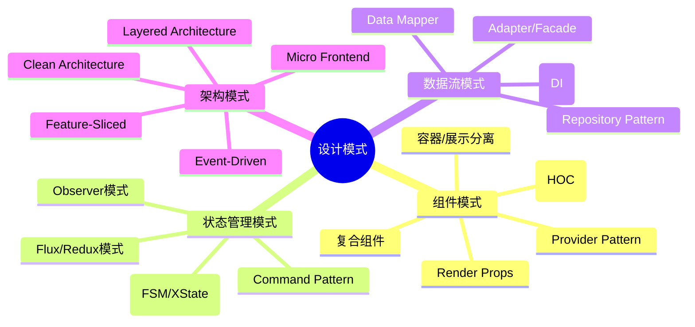

# 30 - 高级设计模式与架构模式

## 🎯 本节目标
- 掌握企业级React应用的核心设计模式
- 学会构建可维护、可扩展的大型应用架构
- 理解各种模式的适用场景和权衡取舍

---

## 📖 设计模式概览

### 分类体系



---

## 🧩 组件设计模式进阶

### 1. 容器/展示模式 (Container/Presentational Pattern)

```jsx
// ✅ 展示组件(Presentational): 只关注UI如何呈现,不知道数据来源
// 特点:
// - 通过Props接收数据和回调函数
// - 通常写成函数组件(除非需要生命周期)
// - 不依赖Redux/Context/Router等全局东西
// - 包含CSS样式(Styled Components/CSS Modules)

function TodoList({ todos, onToggle, onDelete }) {
  if (todos.length === 0) {
    return <EmptyState message="还没有待办事项,添加一个吧!" />;
  }

  return (
    <ul className="todo-list">
      {todos.map(todo => (
        <TodoItem
          key={todo.id}
          text={todo.text}
          completed={todo.completed}
          priority={todo.priority}
          onToggle={() => onToggle(todo.id)}
          onDelete={() => onDelete(todo.id)}
        />
      ))}
    </ul>
  );
}

// ✅ 容器组件(Container): 关注数据如何获取和行为逻辑
// 特点:
// - 连接数据源(Redux store/Context/Hooks/API)
// - 向展示组件传递数据和回调
// - 通常不包含DOM标记(除了包装div)
// - 可能包含生命周期或Effect来获取数据

function TodoListContainer() {
  // 所有数据获取和状态管理逻辑在这里
  const { data: todos, isLoading, error } = useQuery(['todos'], fetchTodos);
  const toggleMutation = useMutation(toggleTodo);
  const deleteMutation = useMutation(deleteTodo);

  const handleToggle = (id) => {
    toggleMutation.mutate(id);
  };

  const handleDelete = (id) => {
    deleteMutation.mutate(id);
  };

  // 渲染对应的展示组件,将所有必要的东西通过props传递下去
  if (isLoading) return <SkeletonLoader />;
  if (error) return <ErrorMessage error={error} />;

  return (
    <TodoList
      todos={todos ?? []}
      onToggle={handleToggle}
      onDelete={handleDelete}
    />
  );
}
```

**何时拆分?**
- 当一个组件同时承担了"获取数据"和"渲染UI"两项职责,且两者都可能独立变化时
- 展示组件可以在不同场景复用(比如同一个`UserCard`可能在Profile页和搜索结果页复用)
- 容器组件可以根据不同数据源灵活组合(比如同一套UI可以接REST API或者GraphQL)

**现代替代方案?**
随着Hooks的普及,这种严格拆分的做法变得不那么绝对了。现在更常见的是:
- 小组件: 直接在组件内部使用Hooks获取数据
- 大型页面组件: 仍保留容器/展示分离以提高可读性和可测试性

### 2. Compound Component (复合组件模式)

**问题**: 如何让一组紧密相关的组件共享状态,又能灵活组合?

**方案**: 让"宿主"组件通过隐式Context向下传递状态,"子组件"消费这个Context。

```jsx
// ✅ 典型案例:Select/Dropdown/Tabs/RadioGroup

function Select({ children, value, onChange }) {
  // 内部维护状态并通过Context传递
  const contextValue = useMemo(() => ({ value, onChange }), [value, onChange]);
  
  return (
    <SelectContext.Provider value={contextValue}>
      <div className="select-container" role="listbox">
        {children}
      </div>
    </SelectContext.Provider>
  );
}

// 子组件从Context中读取所需的数据和方法
function SelectOption({ value: optionValue, children, disabled }) {
  const { value: selectedValue, onChange } = useContext(SelectContext);
  
  const isSelected = selectedValue === optionValue;
  
  const handleClick = () => {
    if (!disabled) {
      onChange(optionValue);
    }
  };

  return (
    <button
      role="option"
      aria-selected={isSelected}
      aria-disabled={disabled}
      onClick={handleClick}
      className={`option ${isSelected ? 'selected' : ''} ${disabled ? 'disabled' : ''}`}
    >
      {typeof children === 'function' 
        ? children(isSelected)  // 支持Render Prop风格的自定义渲染!
        : children
      }
    </button>
  );
}

// 将子组件挂载到主组件上作为静态属性(方便导入和使用)
Select.Option = SelectOption;

// ✨ 使用方式极其灵活!
function App() {
  const [selectedFruit, setSelectedFruit] = useState('apple');

  return (
    <Select value={selectedFruit} onChange={setSelectedFruit}>
      <Select.Option value="apple">🍎 苹果</Select.Option>
      <Select.Option value="banana">🍌 香蕉</Select.Option>
      <Select.Option value="orange">🍊 橙子</Select.Option>
      
      {/* 还可以自由穿插其他元素! */}
      <div className="divider" />
      
      <Select.Option value="grape" disabled>🍇 葡萄(暂时缺货)</Select.Option>
      
      {/* 甚至可以使用自定义渲染! */}
      <Select.Option value="watermelon">
        {(isSelected) => (
          <span className={`watermelon ${isSelected ? 'bold' : ''}`}>
            🍉 西瓜 {isSelected && '(超甜!)'}
          </span>
        )}
      </Select.Option>
    </Select>
  );
}
```

**另一个经典例子:Radio Group**

```jsx
function RadioGroup({ name, value, onChange, children, orientation = 'vertical' }) {
  return (
    <RadioContext.Provider value={{ name, value, onChange }}>
      <div role="radiogroup" aria-label={name} className={`radio-group ${orientation}`}>
        {children}
      </div>
    </RadioContext.Provider>
  );
}

function Radio({ value, disabled, children }) {
  const { name, value: selectedValue, onChange } = useContext(RadioContext);
  const checked = value === selectedValue;

  return (
    <label className={`radio-label ${disabled ? 'disabled' : ''}`}>
      <input
        type="radio"
        name={name}
        value={value}
        checked={checked}
        disabled={disabled}
        onChange={() => onChange(value)}
      />
      <span className={`radio-custom ${checked ? 'checked' : ''}`} />
      <span className="radio-text">{children}</span>
    </label>
  );
}

RadioGroup.Radio = Radio;

// 使用
<RadioGroup name="theme" value={theme} onChange={setTheme} orientation="horizontal">
  <RadioGroup.Radio value="light">浅色模式</RadioGroup.Radio>
  <RadioGroup.Radio value="dark">深色模式</RadioGroup.Radio>
  <RadioGroup.Radio value="auto">跟随系统</RadioGroup.Radio>
</RadioGroup>
```

### 3. Control Props / State Reducer Pattern (受控与非受控统一)

**问题**: 一个组件既想开箱即用(内部管理自己的状态),又想让使用者完全控制(像Input那样可控)。

**方案**: 同时支持`value`(controlled)和无value(uncontrolled),内部自动判断模式。

```jsx
// ✅ 通用的受控/非受控Hook
function useControlledState({ controlledValue, defaultValue, onChange, name = 'component' }) {
  // 是否处于受控模式(由外部是否传入了value来判断)
  const isControlled = controlledValue !== undefined;
  
  // 内部状态(仅在非受控模式下使用)
  const [internalValue, setInternalValue] = useState(defaultValue);
  
  const value = isControlled ? controlledValue : internalValue;
  
  const handleChange = useCallback((newValue, ...args) => {
    // 无论哪种模式,都要调用onChange通知外部
    if (onChange) {
      onChange(newValue, ...args);
    }
    
    // 仅在非受控模式才更新内部状态
    if (!isControlled) {
      setInternalValue(newValue);
    }
  }, [onChange, isControlled]);

  // 开发环境警告:不要在渲染过程中改变受控/非受控模式(会导致状态丢失)
  if (process.env.NODE_ENV === 'development') {
    const prevControlled = useRef(isControlled);
    useEffect(() => {
      if (prevControlled.current !== isControlled) {
        console.warn(
          `${name}: 组件从${prevControlled.current ? '受控' : '非受控'}变为${isControled ? '受控' : '非受控'}模式。` +
          `这可能导致组件状态意外重置。`
        );
        prevControlled.current = isControled;
      }
    });
  }

  return [value, handleChange];
}

// ✅ 使用该Hook构建高级组件(Tabs示例)
function Tabs({ 
  activeTab: controlledActiveTab, 
  defaultActiveTab = 0, 
  onTabChange,
  children,
}) {
  const [activeTab, setActiveTab] = useControlledState({
    controlledValue: controlledActiveTab,
    defaultValue: defaultActiveTab,
    onChange: onTabChange,
    name: 'Tabs',
  });

  // 渲染子组件并注入active状态
  const renderedChildren = Children.map(children, (child, index) => {
    // 如果子组件是Tab.Panel,注入isActive prop
    if (isValidElement(child) && child.type === TabPanel) {
      return cloneElement(child, {
        isActive: activeTab === index,
      });
    }
    return child;
  });

  return (
    <div className="tabs">
      <div role="tablist" className="tab-headers">
        {Children.map(children, (child, index) => (
          <button
            key={index}
            role="tab"
            aria-selected={activeTab === index}
            onClick={() => setActiveTab(index)}
          >
            {/* 尝试读取子组件上的title或label属性作为tab标题 */}
            {child.props?.label ?? child.props?.title ?? `Tab ${index + 1}`}
          </button>
        ))}
      </div>
      
      <div className="tab-content">
        {renderedChildren.filter(child => 
          isValidElement(child) && (child.type === TabPanel)
        )}
      </div>
    </div>
  );
}

Tabs.Panel = function TabPanel({ children, isActive }) {
  return isActive ? <div role="tabpanel">{children}</div> : null;
};

// ✨ 使用方式
// 非受控模式(内部管理状态)
<Tabs defaultActiveTab={1}>
  <Tabs.Panel label="基本信息">...</Tabs.Panel>
  <Tabs.Panel label="详细设置">...</Tabs.Panel>
  <Tabs.Panel label="高级选项">...</Tabs.Panel>
</Tabs>

// 受控模式(由外部状态控制)
function SettingsPage() {
  const [tab, setTab] = useState(0);
  // tab可以保存到URL query param,这样刷新不会丢失!
  
  return (
    <Tabs activeTab={tab} onTabChange={setTab}>
      <Tabs.Panel label="基本信息">...</Tabs.Panel>
      ...
    </Tabs>
  );
}
```

---

## 🔄 状态管理模式

### 1. Observer Pattern (观察者模式)

**核心思想**: 一对多的依赖关系。当"主体"(Subject)状态发生变化时,所有依赖于它的"观察者"(Observer)都会收到通知并自动更新。

**在React中的应用**:

#### A. 自定义事件总线(Event Bus)

```typescript
// utils/EventBus.ts
type EventMap = {
  'auth:login': { user: User };
  'auth:logout': {};
  'cart:update': { itemCount: number };
  'notification:show': { type: 'success' | 'error'; message: string };
  'theme:change': { theme: Theme };
};

class EventBus<E extends Record<string, any>> {
  private events: Map<keyof E, Set<Function>> = new Map();

  // 订阅事件
  on<K extends keyof E>(event: K, listener: (payload: E[K]) => void): () => void {
    if (!this.events.has(event)) {
      this.events.set(event, new Set());
    }
    
    this.events.get(event)!.add(listener);
    
    // 返回取消订阅的函数(方便cleanup)
    return () => {
      this.events.get(event)?.delete(listener);
    };
  }

  // 只订阅一次
  once<K extends keyof E>(event: K, listener: (payload: E[K]) => void): () => void {
    const wrapperListener = (payload: E[K]) => {
      listener(payload);
      this.off(event, wrapperListener as any);
    };
    
    return this.on(event, wrapperListener as any);
  }

  // 发布事件
  emit<K extends keyof E>(event: K, payload: E[K]): void {
    const listeners = this.events.get(event);
    if (listeners) {
      listeners.forEach(listener => {
        try {
          listener(payload);
        } catch (error) {
          console.error(`Error in event listener for "${String(event)}":`, error);
        }
      });
    }
  }

  // 取消订阅
  off<K extends keyof E>(event: K, listener?: Function): void {
    if (listener) {
      this.events.get(event)?.delete(listener);
    } else {
      this.events.delete(event);  // 清除该事件的全部listener
    }
  }

  // 清除所有事件
  clear(): void {
    this.events.clear();
  }
}

// 全局单例
export const eventBus = new EventBus<EventMap>();

// hooks/useEventBus.ts (React集成)
export function useEventListener<K extends keyof EventMap>(
  event: K,
  handler: (payload: EventMap[K]) => void,
  deps: DependencyList = [],
) {
  const handlerRef = useRef(handler);
  
  // 保持handler引用最新(避免stale closure问题)
  useEffect(() => {
    handlerRef.current = handler;
  });

  useEffect(() => {
    const unsubscribe = eventBus.on(event, (payload) => {
      handlerRef.current(payload);  // 使用ref始终拿到最新的handler
    });
    
    return unsubscribe;  // 组件卸载时自动取消订阅!
  }, [event, /* 注意:不要把handler放在这里! */ ...deps]);
}
```

**使用示例**:

```tsx
// 组件A:发布登录成功事件
function LoginForm() {
  const handleSubmit = async (credentials) => {
    const user = await login(credentials);
    eventBus.emit('auth:login', { user });
  };

  return <form onSubmit={handleSubmit}>...</form>;
}

// 组件B:监听登录事件以更新UI
function Header() {
  const [user, setUser] = useState(null);
  
  useEventListener('auth:login', ({ user: loggedInUser }) => {
    setUser(loggedInUser);
  });

  useEventListener('auth:logout', () => {
    setUser(null);
  });

  return user 
    ? <UserMenu user={user} /> 
    : <LoginButton />;
}

// 组件C:监听购物车变更显示角标数字
function CartIcon() {
  const [count, setCount] = useState(0);

  useEventListener('cart:update', ({ itemCount }) => {
    setCount(itemCount);
  });

  return (
    <Badge count={count}>
      <ShoppingCartIcon />
    </Badge>
  );
}
```

**优点**:
- 完全解耦,A和B互不知道彼此的存在
- 新增消费者非常容易,不用修改生产者
- 适合**跨层级**、**跨模块**通信(如插件系统)

**缺点**:
- 流程难以追踪(谁发了?谁收了?)
- 可能导致" spaghetti code "(意大利面条式代码)
- 调试困难

**适用场景**:
- 全局性的、松耦合的事件(登录登出/主题切换/通知)
- 插件系统或微内核架构
- 避免层层传递callback的情况(prop drilling严重时)

#### B. RxJS Observable (响应式编程)

```bash
npm install rxjs
```

```typescript
import { BehaviorSubject, Subject, fromEvent } from 'rxjs';
import { debounceTime, distinctUntilChanged, filter, map, scan, switchMap, tap } from 'rxjs/operators';

// ✅ 行为主体(BehaviorSubject): 总是有初始值,新订阅者立即收到最近的一个值
const searchQuery$ = new BehaviorSubject<string>('');

// ✅ 构建响应式搜索流程
const searchResults$ = searchQuery$.pipe(
  debounceTime(300),  // 防抖300ms
  distinctUntilChanged(),  // 值不变则忽略
  filter(query => query.length >= 2),  // 至少2个字符才搜索
  tap(query => console.log('Searching for:', query)),
  switchMap(query => fetchSearchResults(query)),  // 取消上一次未完成的请求!
  map(response => response.items),
  // 可以继续链式操作...
);

// 在React中使用RxJS
function SearchComponent() {
  const [results, setResults] = useState([]);
  const [isLoading, setIsLoading] = useState(false);

  useEffect(() => {
    // 订阅Observable
    const subscription = searchResults$.subscribe({
      next: items => {
        setResults(items);
        setIsLoading(false);
      },
      error: err => {
        console.error(err);
        setIsLoading(false);
      },
    });

    // 同时订阅loading状态(可选)
    const loadingSub = searchQuery$.pipe(
      tap(() => setIsLoading(true))
    ).subscribe();

    return () => {
      subscription.unsubscribe();
      loadingSub.unsubscribe();
    };
  }, []);

  const handleChange = (text: string) => {
    searchQuery$.next(text);  // 推送新的查询值!
  };

  return (
    <div>
      <input onChange={e => handleChange(e.target.value)} />
      {isLoading && <Spinner />}
      <ul>
        {results.map(item => <li key={item.id}>{item.name}</li>)}
      </ul>
    </div>
  );
}
```

### 2. State Machine (状态机模式)

**核心思想**: 任何复杂的交互都可以建模为有限个**明确的状态**,以及状态之间经过**明确的转换事件**。

**为什么需要状态机?**
- 避免"千层if-else"或混乱的boolean标志(`isLoading && !isError && !isAuthenticated`)
- 明确哪些转换是合法的(防止非法状态)
- 易于可视化(UML状态图)和调试
- 特别适合:**表单提交流程**、**审批工作流**、**网络请求状态**、**游戏角色状态**

#### A. 简单的手动状态机 (UseReducer)

```typescript
// 定义状态
type FormState = {
  type: 'idle' | 'submitting' | 'success' | 'error';
  data?: FormData;
  error?: Error;
};

// 定义动作(Action)
type FormAction =
  | { type: 'SUBMIT'; payload: FormData }
  | { type: 'SUCCESS' }
  | { type: 'FAIL'; payload: Error }
  | { type: 'RESET' };

// 定义状态转换逻辑(纯函数)
function formReducer(state: FormState, action: FormAction): FormState {
  switch (state.type) {
    case 'idle':
      switch (action.type) {
        case 'SUBMIT': return { type: 'submitting', data: action.payload };
        default: return state;
      }
    
    case 'submitting':
      switch (action.type) {
        case 'SUCCESS': return { type: 'success', data: state.data };
        case 'FAIL': return { type: 'error', error: action.payload, data: state.data };
        default: return state;
      }

    case 'success':
    case 'error':
      switch (action.type) {
        case 'SUBMIT': return { type: 'submitting', data: action.payload };  // 允许重新提交
        case 'RESET': return { type: 'idle' };
        default: return state;
      }
      
    default:
      return state;
  }
}

// 在组件中使用
function ContactForm() {
  const [formState, dispatch] = useReducer(formReducer, { type: 'idle' });

  const handleSubmit = async (formData: FormData) {
    dispatch({ type: 'SUBMIT', payload: formData });
    
    try {
      await api.submitForm(formData);
      dispatch({ type: 'SUCCESS' });
    } catch (error) {
      dispatch({ type: 'FAIL', payload: error });
    }
  };

  // 根据状态渲染不同的UI
  return (
    <div>
      {formState.type === 'idle' && <FormFields onSubmit={handleSubmit} />}
      
      {formState.type === 'submitting' && <LoadingOverlay message="正在提交..." />}
      
      {formState.type === 'success' && (
        <SuccessState 
          message="提交成功!" 
          onReset={() => dispatch({ type: 'RESET' })} 
        />
      )}
      
      {formState.type === 'error' && (
        <ErrorState 
          error={formState.error!} 
          onRetry={() => dispatch({ type: 'SUBMIT', payload: formState.data! })} 
          onCancel={() => dispatch({ type: 'RESET' })} 
        />
      )}
    </div>
  );
}
```

#### B. XState (正式的状态机库,功能更强)

```bash
npm install xstate @xstate/react
```

```typescript
import { createMachine, assign } from 'xstate';
import { useMachine } from '@xstate/react';

// ✅ 用XState定义更复杂的机器(支持并行状态、嵌套状态、守卫、延迟、服务等)
const toggleMachine = createMachine({
  id: 'toggle',
  initial: 'inactive',
  context: {
    count: 0,  // 扩展状态(不影响状态转移但携带数据)
  },
  states: {
    inactive: {
      on: {
        TOGGLE: { target: 'active', actions: assign({ count: ctx => ctx.count + 1 }) },
      },
    },
    active: {
      // entry / exit动作(进入/离开状态时执行)
      entry: ['logActivated'],
      exit: ['logDeactivated'],
      
      on: {
        TOGGLE: { target: 'inactive' },
        INC: { actions: assign({ count: ctx => ctx.count + 1 }) },  // 自我转换(停留在原状态)
      },
    },
  },
},
{
  actions: {
    logActivated: () => console.log('Entered Active'),
    logDeactivated: () => console.log('Left Active'),
  },
});

function ToggleComponent() {
  const [current, send] = useMachine(toggleMachine);

  return (
    <div>
      <button onClick={() => send('TOGGLE')}>
        {current.matches('active') ? 'ON' : 'OFF'}
      </button>
      
      {current.matches('active') && (
        <button onClick={() => send('INC')}>
          Count: {current.context.count}
        </button>
      )}
      
      <pre>{JSON.stringify(current.value, null, 2)}</pre>
    </div>
  );
}
```

**XState更适合的场景**:
- 多步向导(Step 1 → Step 2 → Step 3,支持前进/后退/分支)
- 审批流程(草稿→审核中→已批准/已驳回→结束)
- 复杂的网络状态(连接中→已认证→同步中→断线重连...)
- 拖拽排序(空闲→拖拽中→放置到合法区域/非法区域)

---

## 🏛️ 架构模式

### 1. Layered Architecture (分层架构)

```
┌─────────────────────────────────────┐
│           Presentation Layer        │  ← UI/组件/页面
│  (React Components / Screens)        │
├─────────────────────────────────────┤
│          Application Layer          │  ← 业务逻辑/用例
│  (Hooks / UseCases / Services)      │
├─────────────────────────────────────┤
│            Domain Layer             │  ← 纯业务规则/实体
│  (Entities / Business Rules)        │
├─────────────────────────────────────┤
│        Infrastructure Layer         │  ← 外部依赖实现
│  (API Client / DB / File System)    │
└─────────────────────────────────────┘
```

**各层职责**:

**Presentation Layer (表现层)**
- React组件、页面、路由配置
- UI交互、表单验证(前端验证)
- 调用Application层的Hook/Service
- **不应该包含**: 直接HTTP请求、复杂算法、业务规则

**Application Layer (应用层)**
- 协调领域对象完成用例
- 封装业务流程(如"下单流程"=检查库存→扣减库存→创建订单→支付→通知)
- 提供给表现层使用的Hooks (useCreateOrder, useFetchUserProfile)
- **不应该包含**: UI相关代码、持久化细节

**Domain Layer (领域层)**
- 核心实体(User/Product/Order)
- 值对象(Money/Email/DateRange)
- 领域服务(价格计算引擎/折扣规则/权限校验)
- **关键特点**: **不依赖任何框架**,纯TypeScript/JavaScript,可独立于React测试!

**Infrastructure Layer (基础设施层)**
- API客户端(Axios实例/GraphQL Client)
- 数据持久化(IndexedDB/LocalStorage/SQLite)
- 第三方SDK封装(PayPal SDK/Analytics SDK)
- 文件系统/文件上传

**代码组织示例**:

```
src/
├── presentation/                  # 表现层
│   ├── components/
│   ├── screens/
│   └── pages/
│
├── application/                   # 应用层
│   ├── use-cases/
│   │   ├── auth/
│   │   │   ├── login.use-case.ts
│   │   │   └── register.use-case.ts
│   │   └── order/
│   │       ├── create-order.use-case.ts
│   │       └── cancel-order.use-case.ts
│   ├── services/
│   │   └── notification.service.ts
│   └── hooks/                     # 暴露给表现层使用的接口
│       ├── useAuth.ts
│       └── useOrders.ts
│
├── domain/                        # 领域层
│   ├── entities/
│   │   ├── user.entity.ts
│   │   ├── product.entity.ts
│   │   └── order.entity.ts
│   ├── value-objects/
│   │   ├── money.ts
│   │   └── email.ts
│   ├── repositories/             # 仓库接口(契约,不是实现!)
│   │   ├── user.repository.ts
│   │   └── order.repository.ts
│   └── services/
│       └── pricing.service.ts     # 价格计算(纯函数)
│
└── infrastructure/                # 基础设施层
    ├── api/
    │   ├── http-client.ts
    │   └── endpoints/
    │       ├── user.api.ts
    │       └── order.api.ts
    ├── repositories/              # 仓库的具体实现
    │   ├── user.repository.impl.ts
    │   └── order.repository.impl.ts
    ├── persistence/
    │   ├── indexeddb.store.ts
    │   └── localstorage.store.ts
    └── external/
        └── stripe.service.ts
```

**具体代码示例**:

```typescript
// domain/entities/order.entity.ts
export class Order {
  constructor(
    public readonly id: string,
    public userId: string,
    public items: OrderItem[],
    public status: OrderStatus,
    public createdAt: Date,
    public totalAmount: Money,
  ) {}

  // 领域行为:计算总价(属于Order自身的知识,不应外包)
  calculateTotal(): Money {
    const subtotal = this.items.reduce((sum, item) => 
      sum.plus(item.price.times(item.quantity)), 
      Money.zero()
    );
    
    // 应用折扣规则(如果有优惠券等)
    return this.applyDiscount(subtotal);
  }

  // 领域行为:能否取消?
  canCancel(): boolean {
    return [OrderStatus.PENDING, OrderStatus.CONFIRMED].includes(this.status);
  }

  // 状态转换(强制合法!)
  cancel(): void {
    if (!this.canCancel()) {
      throw new DomainError(`无法取消${this.status}状态的订单`);
    }
    this.status = OrderStatus.CANCELLED;
  }
}

// domain/repositories/order.repository.ts (接口)
export interface IOrderRepository {
  findById(id: string): Promise<Order | null>;
  save(order: Promise<Order>): Promise<void>;
  findPendingForUser(userId: string): Promise<Order[]>;
}

// application/hooks/useOrders.ts (应用层→表现层的桥梁)
export function useOrders(orderRepo: IOrderRepository) {  // 依赖注入!
  const createOrder = useCallback(async (input: CreateOrderDTO) => {
    // 1. 创建领域对象
    const order = Order.create(input.userId, input.items);
    
    // 2. 调用领域服务进行业务校验
    pricingService.validateAndCalculateTotal(order);
    
    // 3. 持久化
    await orderRepo.save(order);
    
    // 4. 发布领域事件(可选)
    eventBus.emit('order:created', { orderId: order.id });
    
    return order;
  }, [orderRepo]);

  const cancelOrder = useCallback(async (orderId: string) => {
    const order = await orderRepo.findById(orderId);
    if (!order) throw new NotFoundError('订单不存在');
    
    order.cancel();  // 领域行为
    
    await orderRepo.save(order);
  }, [orderRepo]);

  return { createOrder, cancelOrder };
}

// infrastructure/repositories/order.repository.impl.ts (实现)
export class HttpOrderRepository implements IOrderRepository {
  constructor(private httpClient: HttpClient) {}

  async findById(id: string): Promise<Order> {
    const json = await this.httpClient.get(`/orders/${id}`);
    return Order.fromJSON(json);  // JSON→Entity的映射
  }

  async save(order: Order): Promise<void> {
    await this.httpClient.post('/orders', order.toJSON());  // Entity→JSON
  }
}

// composition-root.ts (组装根:依赖注入的地方)
const httpClient = new AxiosHttpClient();  // Infrastructure
const orderRepo = new HttpOrderRepository(httpClient);  // Infrastructure implements Domain interface
const useOrdersHook = useOrders(orderRepo);  // Application depends on Domain abstraction

// presentation/screens/OrderScreen.tsx
function OrderScreen() {
  const { createOrder, cancelOrder } = useOrders(orderRepo);  // 来自Composition Root

  // UI logic only...
}
```

### 2. Feature-Sliced Design (FSD)

**核心理念**: 按**业务功能(Feature)**而非技术角色分层。

```
src/
├── app/                    # 应用入口/全局布局/路由/Provider
│   ├── App.tsx
│   ├── providers.tsx
│   └── router.tsx
│
├── processes/              # 跨功能的业务流程
│   ├── auth/               # 认证流程(影响多个feature)
│   │   ├── model/
│   │   ├── ui/
│   │   └── index.ts
│   └── routing/            # 全局路由
│
├── entities/               # 全局共享的业务实体(通常稳定少变)
│   ├── user/
│   │   ├── model/          # 实体定义/类型
│   │   └── api/            # 远程数据获取
│   └── currency/
│
├── features/               # 核心业务功能(独立的、自包含的!)
│   ├── cart/               # 购物车功能
│   │   ├── model/          # 状态/逻辑/实体
│   │   │   ├── cart.slice.ts
│   │   │   ├── cart.types.ts
│   │   │   └── index.ts
│   │   ├── ui/             # 该Feature的UI组件
│   │   │   ├── CartItem.tsx
│   │   │   ├── CartSummary.tsx
│   │   │   └── index.ts
│   │   ├── shared/         # 仅供该Feature内部的共享工具/UI
│   │   └── index.ts        # 公共API(暴露model/ui给外部)
│   │
│   ├── checkout/           # 结账功能
│   │   ├── model/
│   │   ├── ui/
│   │   └── index.ts
│   │
│   └── product-catalog/    # 产品目录
│       ├── model/
│       ├── ui/
│       └── index.ts
│
├── widgets/                # 组合多个Feature的有状态UI块(页面级的组件)
│   ├── Header/
│   ├── Footer/
│   ├── Layout/
│   └── ShoppingCartWidget/
│
├── pages/                  # 页面(组合widgets/features)
│   ├── HomePage.tsx
│   ├── ProductDetailPage.tsx
│   └── CheckoutPage.tsx
│
└── shared/                 # 纯技术层面的共享(UI库/工具函数/配置)
    ├── lib/
    │   ├── axios.ts
    │   ├── query-client.ts
    │   └── storage.ts
    ├── ui/
    │   ├── components/
    │   │   ├── Button.tsx
    │   │   ├── Modal.tsx
    │   │   └── Input.tsx
    │   └── themes/
    ├── config/
    │   ├── env.ts
    │   └── constants.ts
    └── utils/
        ├── date.ts
        └── format.ts
```

**FSD的关键约束**:
1. **上层可以依赖下层,下层绝不能反向依赖上层**
   - `pages` 可以 import `features/cart/ui` 和 `widgets/Header`
   - `features/checkout` 不能 import `features/product-catalog/ui` (只能import其model/type)
   
2. **Features之间只能通过公开API(index.ts)交互**
   - `features/cart/index.ts` 导出`useAddToCart(cartItemId)` hook
   - `features/checkout` 调用这个hook,不需要知道Cart内部实现
   
3. **Entities是稳定的,Features是易变的**
   - User Entity很少变动,所以放在顶层entities
   - Cart功能可能频繁改版,所以隔离在features里

**优势**:
- 功能边界清晰,团队分工容易("你负责cart feature,我负责checkout")
- 重构/删除某个feature很干净(删掉整个文件夹即可)
- 循环依赖几乎不可能出现(严格的层级约束)

### 3. Plugin / Extension Architecture (插件架构)

**适用场景**: 需要让第三方开发者或未来自己扩展系统的能力(如编辑器/低代码平台/Dashboard系统)。

```typescript
// core/plugin-system.ts

// 插件必须实现的接口
interface IPlugin {
  name: string;
  version: string;
  init(context: PluginContext): void | Promise<void>;  // 初始化
  destroy?(): void | Promise<void>;  // 销毁(清理副作用)
}

// 插件上下文:宿主提供给插件的API能力
interface PluginContext {
  // UI扩展点
  registerToolbarItem(item: ToolbarItemConfig): void;
  registerSidebarPanel(panel: SidebarPanelConfig): void;
  registerContextMenuAction(menuItem: ContextMenuItem): void;
  registerSettingsSection(section: SettingsSection): void;
  
  // 数据扩展
  registerDataSource(source: DataSourceDefinition): void;
  registerApiEndpoint(endpoint: ApiEndpointDef): void;
  
  // 生命周期钩子
  onAppInit(callback: () => void): void;
  onRouteChange(callback: (route: Route) => void): void;
  
  // 工具
  logger: Logger;
  notify: NotificationService;
  storage: StorageService;
  state: GlobalStateManager;
  i18n: InternationalizationService;
}

// 插件管理器
class PluginManager {
  private plugins: Map<string, IPlugin> = new Map();
  private context: PluginContext;
  private extensionPoints: Map<string, any[]> = new Map();  // 存储注册的扩展

  constructor(private appCore: AppCore) {
    // 构建上下文(注入宿主能力)
    this.context = this.buildContext();
  }

  async loadPlugins(pluginManifests: PluginManifest[]) {
    for (const manifest of pluginManifests) {
      if (manifest.enabled === false) continue;
      
      try {
        // 动态导入插件代码(代码分割)
        const module = await import(/* webpackChunkName: "[request]" */ manifest.entry);
        const PluginClass = module.default;
        
        const instance = new PluginClass(manifest.config);
        
        // 调用init生命周期
        await instance.init(this.context);
        
        this.plugins.set(manifest.name, instance);
        console.log(`Plugin "${manifest.name}" loaded successfully.`);
      } catch (error) {
        console.error(`Failed to load plugin "${manifest.name}":`, error);
      }
    }
  }

  destroyAll() {
    for (const [name, plugin] of this.plugins) {
      try {
        plugin.destroy?.();
      } catch (e) {
        console.warn(`Error destroying plugin "${name}"`);
      }
    }
    this.plugins.clear();
  }

  // 内部:构建PluginContext
  private buildContext(): PluginContext {
    return {
      // 注册Toolbar项的实现:收集到一个数组,然后Header组件遍历渲染
      registerToolbarItem: (item) => {
        this.getExtensions('toolbar').push(item);
      },
      // ...其他register方法的实现类似
      
      onAppInit: (cb) => this.appCore.hooks.appInit.tap(cb),
      onRouteChange: (cb) => this.appCore.hooks.routeChange.tap(cb),
      
      logger: this.appCore.services.logger,
      notify: this.appCore.services.notify,
      // ...注入其他服务
    };
  }

  private getExtensions(point: string): any[] {
    if (!this.extensionPoints.has(point)) {
      this.extensionPoints.set(point, []);
    }
    return this.extensionPoints.get(point)!;
  }

  // 供UI层查询已注册的扩展(例如Header组件需要知道有哪些Toolbar按钮)
  getRegisteredExtensions(point: string): any[] {
    return this.getExtensions(point);
  }
}

// ✅ 插件编写示例(第三方开发者视角)
// plugins/hello-world/index.ts
export default class HelloWorldPlugin implements IPlugin {
  name = 'hello-world';
  version = '1.0.0';

  async init(ctx: PluginContext) {
    ctx.registerToolbarItem({
      id: 'hello-btn',
      label: 'Say Hello!',
      icon: 'wave-icon',
      position: 'right',  // 在右侧
      onClick: () => {
        ctx.notify.success('Hello from Hello World Plugin! 🎉');
      },
    });

    ctx.registerSidebarPanel({
      id: 'hello-panel',
      title: 'Greeting Panel',
      icon: 'chat-icon',
      component: lazy(() => import('./GreetingPanel')),  // 异步加载组件
    });

    ctx.logger.info('HelloWorld Plugin initialized!');
  }

  destroy() {
    console.log('Goodbye!');
  }
}

// ✅ 宿主应用使用
// App.tsx
function App() {
  const pluginManagerRef = useRef(new PluginManager(appCore));

  useEffect(() => {
    // 启动时加载所有启用的插件
    pluginManagerRef.current.loadPlugins([
      { name: 'hello-world', enabled: true, entry: './plugins/hello-world', config: {} },
      { name: 'analytics', enabled: true, entry: './plugins/analytics', config: { trackingId: 'UA-XXX' } },
      // 可以从远程API拉取插件列表,实现真正的插件市场!
    ]);
  }, []);

  return (
    <Layout>
      <Header extensions={pluginManager.getRegisteredExtensions('toolbar')} />
      <Sidebar panels={pluginManager.getRegisteredExtensions('sidebar')} />
      <MainArea />
    </Layout>
  );
}
```

---

## 📊 模式选择指南

| 场景 | 推荐模式 | 替代方案 |
|------|---------|---------|
| **组件间共享状态(同层级)** | Lift State Up / Context | Zustand/Jotai |
| **跨多层级传递数据** | Context / Compound Component | DI / Event Bus |
| **组件逻辑复用** | Custom Hooks | HOC / Render Props |
| **复杂的多步骤交互** | State Machine (XState) | useReducer |
| **异步数据流** | React Query/SWR + RxJS(可选) | Redux Thunk/Saga |
| **全局事件通知** | Event Bus / PubSub | Context + useSyncExternalStore |
| **大型应用架构** | Feature-Sliced / Layered | Module Federation |
| **可扩展的插件系统** | Plugin Arch (Extension Points) | 微前端 |
| **多人协作的大项目** | Domain-Driven Design (DDD) | Clean Architecture |

---

## 📝 练习任务

### 任务1:重构现有项目为Feature-Sliced架构
选取一个你做过的小/中型项目:
1. 分析现有的文件结构,识别出潜在的"Feature"
2. 按照 FSD 规范重组目录
3. 抽取公共的 Entities / Shared / Widgets
4. 确保 Features 之间的依赖方向正确
5. 写一篇迁移总结报告(遇到的问题/收益)

### 任务2:实现一个带状态机的复杂表单向导
要求:
1. 使用 XState 定义至少5种以上的状态(包括中间态)
2. 支持前进/后退/分支/并行(如果有多步骤)
3. 每个状态有明确的entry/exit动作
4. 集成表单验证(每个step有自己的校验规则)
5. 进度条实时反映当前所在状态
6. URL同步(刷新不丢失进度)

### 任务3:设计一个Dashboard Widget插件系统
实现:
1. **Widget Registry**(注册/注销/查找)
2. **Widget Lifecycle**(init/configure/resize/destroy/data-refresh)
3. **Grid Layout System**(拖拽调整大小/位置,保存布局偏好)
4. **Widget Marketplace**(模拟的,可以从"商店"安装新widget)
5. **沙箱机制**(限制widget的权限/样式作用域隔离)

---

## 🔗 相关资源

- [Design Patterns: Elements of Reusable Object-Oriented Software (GoF)](https://en.wikipedia.org/wiki/Design_Patterns)
- [Patterns.dev (Modern Web Patterns)](https://www.patterns.dev/)
- [Frontend Architecture (Sam Selikoff)](https://frontendmasters.com/courses/frontend-architecture/) (付费课程)
- [Clean Architecture (Robert C. Martin)](https://blog.cleancoder.com/uncle-bob/2012/08/13/the-clean-architecture.html)
- [Feature-Sliced Design (官方)](https://feature-sliced.design/)
- [XState Documentation](https://xstate.js.org/docs/)
- [RxJS Marbles (可视化Observable)](rxjs-dev.firebaseapp.com/)

---

[← 29 - React Native移动端](../29-react-native/) | [→ 返回主页](../README.md)
